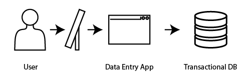
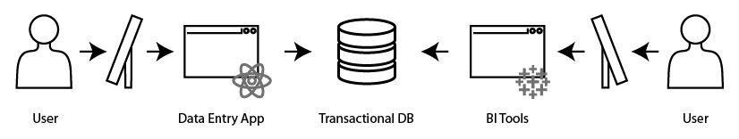

# **Shifting Left on Data Quality**

From databases to data-mesh, a history of data storage

[**@Sutirtha Das**](https://github.com/Ahtritus) [**@Tanuja Mehra**](https://github.com/TANUJAMEHRA)

---

# **Introduction**

Is datamesh a fad? Should we skip this one and wait for the next one?

---

# **Databases**

- Let's store some data. How about a file? How about a bunch of files?
- Monolithic databases.

---
## Features
- Consistent data in rows & columns
- Normalized data
    - reduces redundancy
    - stored smaller
    - Joins between tables
- ACID compliance

---
***... a few years later***

## **Data Analytics**

- Bulk Reads 
- No writes 

---
## Features
- query in unusual ways
- so queries are slow
- so table is locked too long
- yields bad performance for transactional app